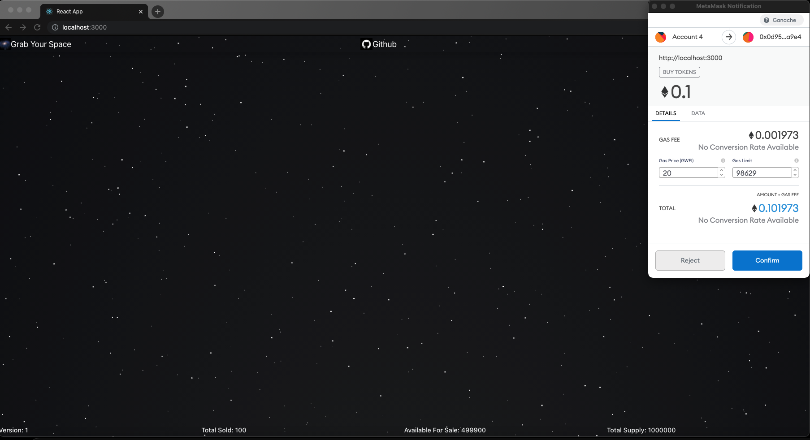

## `Space Token ERC20 + Crowd Sale `

### Welcome to the SpaceToken Repo

    -- This repo consists two solidity contract, and a frontend client app:

        1. SpaceToken.sol: This is a contract for the ERC20 token

        2. SpaceTokenSale.sol: This is a contract for the CrowdSale  for the token

        3. The Client App: Connects to metamask to facilitate authorize transactions

    -- This is a basic token that I built to understand the ERC20 architecture, and Rinkeby deployment

    -- The token is deplyed by admin, and the sale contract can only be started/ended by the admin, with an initial sale quantity.

    -- The contracts are written in Solidity Language, and tested and
        deployed using Ganache and Truffle Framework

    -- The Client Side app is developed using React.JS & Web3.js

    -- The tests are written using Chai Framework

## Screen shots Of the Running App

### Admin Page

(The client side front-page with the admin account)

### Home Page - Account 1

(The Account with 0 tokens)

### Account 1 - buy tokens

(The account buy transaction verification)

### Account 1 - bought tokens

(The account buy transaction completed)

## Available Scripts

## Starting the Block Chain Network and Deploying the contracts

#### Install Ganache, Truffle Framework, and Metamask Browser Extention

In the project directory, you can run:

### `npm install`

Installs all the necessary packages to run the app i development mode.\

The cosole will show if the packages were successfully installed.\
You will also see any lint errors in the console.

### `truffle migrate --reset`

Deploys the contract on the network, and resets any other version of the contract on the network.

### `truffle console`

Open up the truffle console to test or check the network details.

### `truffle test`

To test the basic tests

## Client Side

### `npm install` & `npm run start`

Runs the app in the development mode.\
Open [http://localhost:3000](http://localhost:3000) to view it in the browser.

The page will reload if you make edits.\
You will also see any lint errors in the console.

# NOTE

you will need metamask extention on your browser, and the ganache account linked to the metamask accounts.
